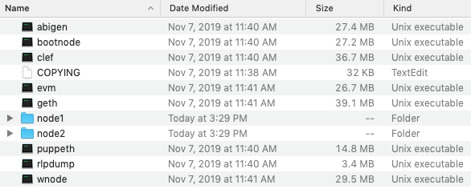
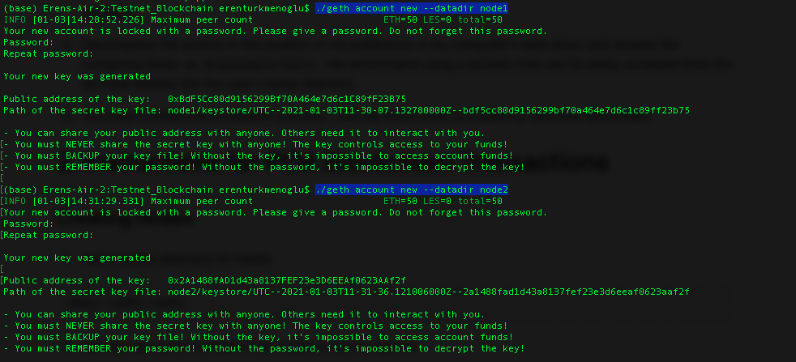
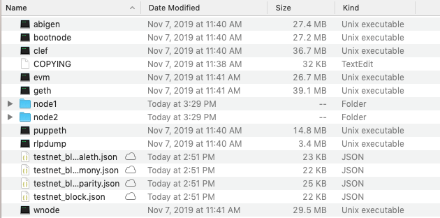
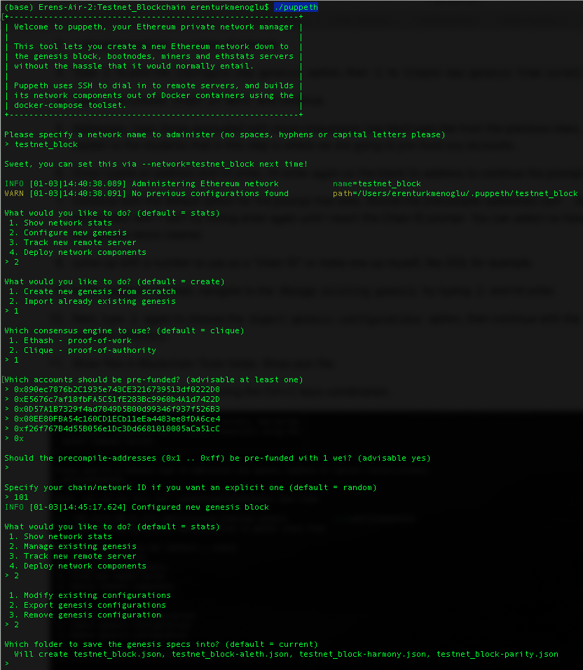
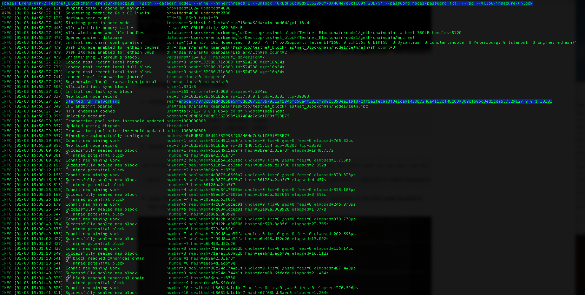
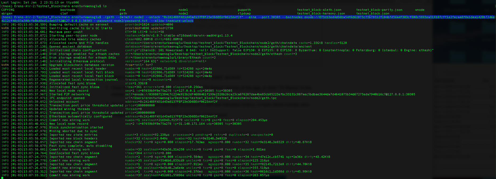
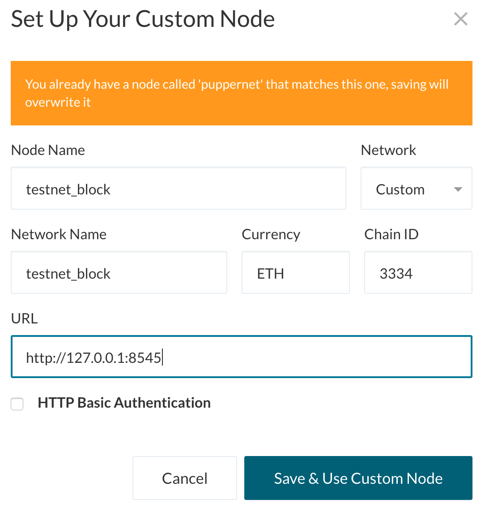

# Assignment #18 - Blockchain  <br /> 

In this project, I will create a testnet blockchain network for an imaginary company. <br />
Below are the steps of this assignment:
- Set up a custom testnet blockchain
- Send a transaction
- Create a repo
- Write instructions on how to use the chain for the rest of the team

In order to set up a testnet, I will need to use the following tools we covered in FinTech bootcamp;
- Puppeth, to generate the genesis block
- Geth, a command-line tool, to create keys, initialize nodes, and connect nodes together
- The clique proof of authority algorithm

# 1. Blockchain Installation Guide <br />
***Installing MyCrypto Desktop App***

MyCrypto is a free, open-source, client-side interface that allows for interacting directly with the blockchain. <br />
For this example, we will use MyCrypto Desktop App to manage ethereum wallets and make transactions in the blockchain. <br />
To install MyCrypto Desktop App, please follow the next steps:

- Open the browser and navigate to https://download.mycrypto.com/.

- Once you download the installer, open the file, and follow the installation wizard.

***Installing Go Ethereum Tools***

Go Ethereum is one of the three original implementations of the Ethereum protocol. It is written in Go, fully open-source and licensed under the GNU LGPL v3. ​

In this example, we will use Go Ethereum Tools to create our very own blockchain, from the genesis block to mining tokens and making transactions. ​

To install the Go Ethereum Tools, please follow the next steps: ​

1. Open the browser and navigate to the Go Ethereum Tools download page at https://geth.ethereum.org/downloads/ ​

2. Scroll down to the "Stable Releases" section and proceed depending on your operating system.​ Click on the ***Geth & Tools 1.9.7*** to download the applications bundle archive. ​

3. After downloading the tools archive, open my "Downloads" folder, and you will find a file named geth-alltools-darwin-amd64-1.9.7-a718daa6.tar.gz in OS X, and a file called geth-alltools-windows-amd64-1.9.7-a718daa6.zip in Windows.

4. Decompress the archive in the location of your preference in your computer's hard drive, and rename the containing folder as Blockchain-Tools. I recommend using a location that can be easily accessed from the terminal window like the user's home directory.

5. You have finished the installation process; you will use these tools to create my very own blockchain! 

# 2. Instructions for POA Blockchain Transactions <br />
***Creating nodes***
1. Add an empty directory for nodes in unzipped folder
```
mkdir node1 node2
```
Your folder will look like this: <br /> 

2. Get new accounts numbers from nodes to use as signers
```
./geth account new --datadir node1
./geth account new --datadir node2
```
3. The system will ask for passwords, after writing passwords for each node, save them for later use.
```
echo 'node1pass' > node1/password.txt
echo 'node2pass' > node2/password.txt
```

4. Do the same for public addresses.
```
echo 'node1address' > node1/accounts.txt
echo 'node2address' > node2/accounts.txt
```


# 3. Running Puppeth <br />
1. Open your terminal window and navigate to your unzipped folder and type the following command.
```
./puppeth
```
2. Name your network ('testnet_block')
3. Type ```2``` to select ```Configure new genesis``` option, then ```1``` to select ```Create new genesis from scratch```
4. Type ```1``` to choose ```Proof of Work``` and continue
5. Addresses: Use those associated with cloud mneumonic in your MyCrypto account, in this process we will prefund our already existing testnet accounts.
6. Once you entered the address that you want to prefund, hit enter to continue if you don't want to enter more addresses.
7. Hit Enter again to continue with default setting until you reach Chain ID prompt. You can select 'No' here to keep the genesis block cleaner.
8. Come up with a number here to use as a "chain ID" or make one up yourself, like ```333```.
9. In the ```puppeth``` prompt, navigate to the ```Manage existing genesis``` by typing ```2``` and hit enter.
10. Next, type ```2``` again to choose the ```Export genesis configurations``` option, then continue with the default (current) directory.
11. Now, you can see the newly created folders in the unzipped file. 

12. Exit the puppeth prompt by using the Ctrl+C keys combination. ​


# 4. Starting the Blockchain <br />
1. Initialize the nodes
```
./geth init puppernet.json --datadir node1
./geth init puppernet.json --datadir node2
```

2. Launch the first node into mining mode with the following command:
```
# Alternatively use --mine console to open up java console and other options such as roc api can be used to protect your transactions, this is just to get running <br />
./geth --datadir node1 --mine --minerthreads 1 --unlock "NODE1_address" --password node1/password.txt  --rpc --allow-insecure-unlock
```
- copy the entire enode:// address (including the last @address:port segment) of the first node located in the Started P2P Networking line:



3. Launch 2nd node
```
./geth --datadir node2 --unlock "NODE2_address" --mine --port 30305 --bootnodes enode://YOUR_ENDCODE_FROM_NODE1 --password node2/password.txt  --allow-insecure-unlock
```




***Note:*** If I ever encounter strange errors, or need to start over without destroying the accounts, run the following command to clear the chain data (this will reset the enode addresses as well): ​
```
rm -Rf node1/geth node2/geth
```

# 5. Setting Network info on MyCrpto
For the nodes to speak to each other a new custom network must be created.
1. Click on "Add Custom Node", then add the custom network information that was set in the genesis. ​
2. Ensure that I scroll down to choose Custom in the "Network" setting to reveal more options like Chain ID: ​
3. The chain ID must match what I came up with earlier. ​
4. The URL is pointing to the default RPC port on my local machine. Everyone should use this same URL: http://127.0.0.1:8545. ​ Click on the "Save & Use Custom Node" button, to use the network; double-check that it is selected and is connected. ​



5. Import the keystore file from the node1/keystore directory into MyCrypto. This will import the private key and will allow you to send ETH to another address.

6. Send a transaction from the node1 account to the node2 account.
7. Copy the transaction hash and paste it into the "TX Status" section of the app, or click "TX Status" in the popup.
8. The transaction is should now read Succesfull! C with the metadata (status, tx hash, block number, etc).
9. Celebrate, I just created a blockchain and sent a transaction!

#### Never share your mainnet private keys! This is a testnet, so coins have no value here!