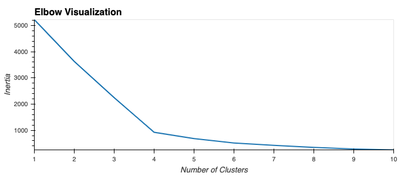
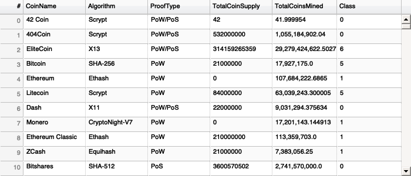
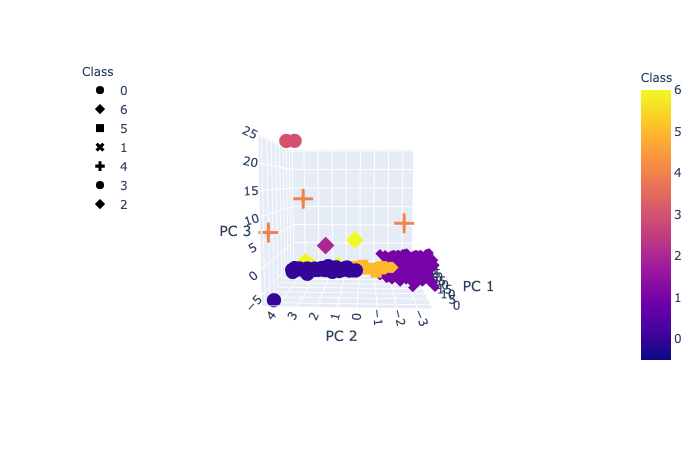
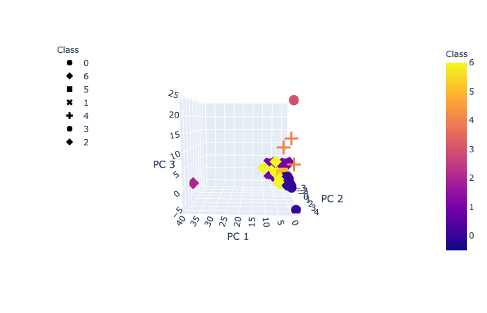
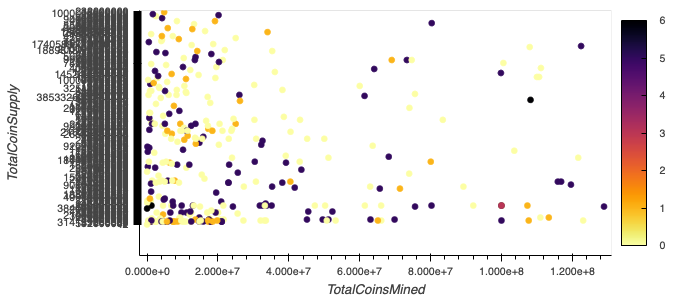

Here's an image of Elbow Visualization to pick the right k-value:

Here's a preview of tradeable crypto currencies' table:

Here's crypto cluster 3d scatter plots from different perspectives:

Here's all cryptos on a 2d plot by supply and mining amounts:

