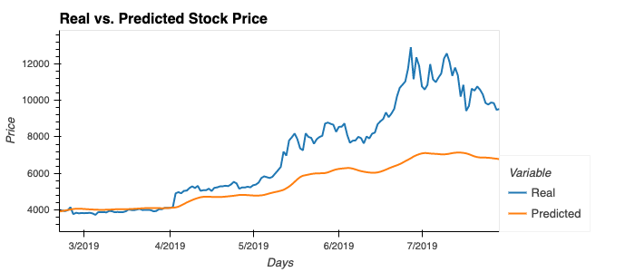
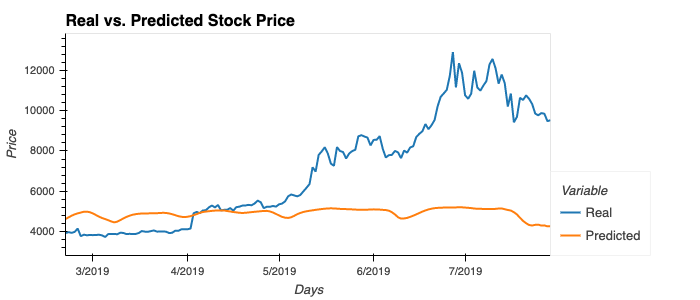

# Homework 14 - Deep Learning

In this assignment, there are two jupyter notebooks each including an LSTM RNN that uses a 10 day window of Bitcoin data to predict the 11th day's closing prices.

The goal here is to build and train a custom LSTM RNN that forecasts 11th day's closing prices in both notebooks with different datasets.
After completing the process in each notebook we'll evaluate the results to compare the accuracy of the two approach. 

# LSTM Stock Predictor Using Fear and Greed Index
'lstm_predictor_closing_ET.ipynb' file includes Bitcoin's closing prices for the period starting from 2018-02-01 to 2019-07-29.

In this notebook, you will build and train a custom LSTM RNN that uses a 10 day window of Bitcoin fear and greed index values to predict the 11th day closing price. 

# LSTM Stock Predictor Using Closing Prices
'lstm_predictor_fng_ET.ipynb' file includes Bitcoin's Fear and Greed index values for the period starting from 2018-02-01 to 2019-07-29.

In this notebook, you will build and train a custom LSTM RNN that uses a 10 day window of Bitcoin closing prices to predict the 11th day closing price. 

You will need to:

1. Prepare the data for training and testing
2. Build and train a custom LSTM RNN
3. Evaluate the performance of the model

Questions we want to answer:

1. Which model has a lower loss?
*lstm_predictor_closing_ET.ipynb:*
Epoch 10/10
371/371 [==============================] - 4s 11ms/step - loss: 0.0132

*lstm_predictor_fng_ET.ipynb:*
Epoch 10/10
371/371 [==============================] - 5s 12ms/step - loss: 0.0245

As you can see above from the evaluation of the two models, the loss is lower in the 1st model with closing prices.

2. Which model tracks the actual values better over time?
Predicted vs. Actual with Closing Prices:

Predicted vs. Actual with Fear and Greed:

3. Which window size works best for the model?

