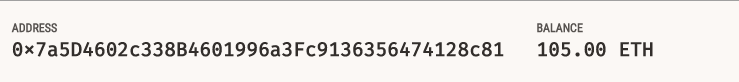
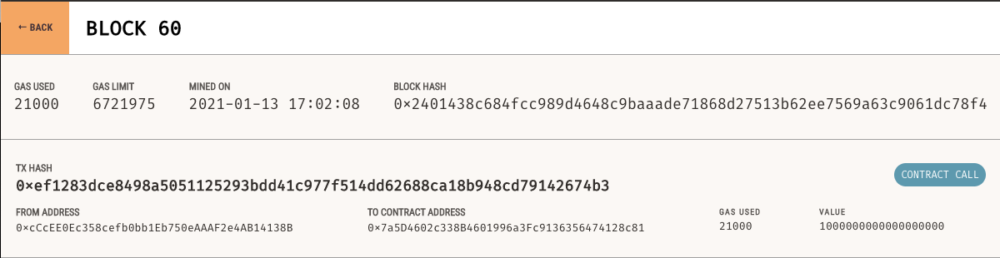
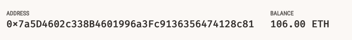

# BLOCKCHAIN WALLET
## Assignment - 19 (Blockchain)

#### Background
Your new startup is focusing on building a portfolio management system that supports not only traditional assets
like gold, silver, stocks, etc, but crypto-assets as well! The problem is, there are so many coins out there! It's
a good thing you understand how HD wallets work, since you'll need to build out a system that can create them.

You're in a race to get to the market. There aren't as many tools available in Python for this sort of thing, yet.
Thankfully, you've found a command line tool, hd-wallet-derive that supports not only BIP32, BIP39, and BIP44, but
also supports non-standard derivation paths for the most popular wallets out there today! However, you need to integrate
the script into your backend with your dear old friend, Python.

Once you've integrated this "universal" wallet, you can begin to manage billions of addresses across 300+ coins, giving
you a serious edge against the competition. In this assignment, however, you will only need to get 2 coins working: Ethereum and Bitcoin Testnet. Ethereum keys are the same format on any network, so the Ethereum keys should work with your custom networks or testnets.

#### Importing Libraries/Dependencies
 * PHP must be installed on your operating system (any version, 5 or 7). Don't worry, you will not need to know any PHP.
 * You will need to clone the hd-wallet-drive tool to the same directory you're working.
 * web3.py Python Ethereum library.
 * bit Python Bitcoin library.
 
 ```
 from constants import *
import os
import subprocess # a Python library allowing us to interact with the command line
import json

from web3 import Web3 # Python Ethereum library
from web3.middleware import geth_poa_middleware
from eth_account import Account
from web3.gas_strategies.time_based import medium_gas_price_strategy

from bit import PrivateKeyTestnet
from bit.network import NetworkAPI

from dotenv import load_dotenv
load_dotenv()
 ```
 
#### Import Mnemonic from .env file
The environment file must be in the same directory with current notebook. <br/>
This is an optional step for not covering our mnemonic phrase in the script.

```
mnemonic = os.getenv('MNEMONIC_KEY')
#print(f'Mnemonic Phrase: {mnemonic}')

# Connecting to a local ETH network
w3 = Web3(Web3.HTTPProvider("http://127.0.0.1:8545"))
w3.middleware_onion.inject(geth_poa_middleware, layer=0)
w3.eth.setGasPriceStrategy(medium_gas_price_strategy)
```

#### Derive wallet
By defining this function we can easily change the Testnet wallet coin

```
def derive_wallets(mnemonic, coin, numderive):
    command = f'./derive -g --mnemonic="{mnemonic}" --cols=index,address,pubkey,privkey --coin="{coin}" --numderive="{numderive}" --format=json' 
    
    p = subprocess.Popen(command, stdout=subprocess.PIPE, shell=True)
    (output, err) = p.communicate()
   
    keys = json.loads(output)
    return  keys
    
# Setting a dictionary of coins to easily pull the keys
coins = {"eth", "btc-test", "btc"}

# Creating a for loop to pull keys for different coins
keys = {}
for coin in coins:
    keys[coin]= derive_wallets(mnemonic, coin, numderive=2)
    
# Assigning private key and address pairs to respective variables
eth_private = keys['eth'][0]['privkey']
eth_address = keys['eth'][0]['address']

btctest_private = keys['btc-test'][0]['privkey']
btctest_address = keys['btc-test'][0]['address']

btc_private = keys['btc'][0]['privkey']
btc_address = keys['btc'][0]['address']

# Creating a function that converts the private key string in a child key to an account object
def priv_key_to_account(coin,priv_key):
    print(coin)
    print(priv_key)
    if coin == ETH:
        return Account.privateKeyToAccount(priv_key)
    elif coin == BTCTEST:
        return PrivateKeyTestnet(priv_key)
        
# Assigning account objects
account_one_eth = priv_key_to_account('eth', eth_private)
account_one_btctest = priv_key_to_account('btc-test', btctest_private)
account_one_btc = priv_key_to_account('btc', btc_private)


# This will create the raw, unsigned transaction that contains all metadata needed to transact.

def create_tx(coin, account, recipient, amount):
    if coin == ETH: 
        gasEstimate = w3.eth.estimateGas(
            {
             "from":account_one_eth.address, 
             "to":recipient, 
             "value": amount
            }
                                        )
        
        return {"from": account_one_eth.address,
                "to": recipient,
                "value": amount,
                "gasPrice": w3.eth.gasPrice,
                "gas": gasEstimate,
                "nonce": w3.eth.getTransactionCount(account_one_eth.address)
                }
    
    elif coin == BTCTEST:
        
        return PrivateKeyTestnet.prepare_transaction(account_one_btctest.address, [(recipient, amount, BTC)])
        
        
        
# This will call 'create_tx', sign the transaction, then send it to the designated network.

def send_txn(coin, account, recipient, amount):
    txn = create_tx(coin, account, recipient, amount)
    
    if coin == ETH:
        signed_txn = account_one_eth.sign_transaction(txn)
        result = w3.eth.sendRawTransaction(signed_txn.rawTransaction)
        #print(result.hex())
        return result.hex()
    
    elif coin == BTCTEST:
        tx_btctest = create_tx(coin, account, recipient, amount)
        signed_txn = account_one_btctest.sign_transaction(txn)
        print(signed_txn)
        return NetworkAPI.broadcast_tx_testnet(signed_txn)
```
#### Now it's the time to confirm the transactions with the process below.
 * Get the balance for the target address
 * Create a transaction
 * Send the transaction
 * Get the balance for the target address again to see the change.
 
```
 # Assigning a target_address variable for ease of use
target_address_eth = keys['eth'][1]['address']
```

This is our target address and its balance before transaction.


```
# Getting the balance for the target ETH address
balance_t0 = w3.eth.getBalance(target_address_eth)# / 10**18
balance_t0
```

```
# Creating a raw transaction
create_tx(ETH, account_one_eth, target_address_eth, 10**18)
```

```
# Signing the transaction
send_txn(ETH, account_one_eth, target_address_eth, 10**18)
```

As you can see in this image, TX HASH and the cryptographic code that we get after executing send_txn function are the same!

```
# Getting the balance to compare the ending balance
balance_t1 = w3.eth.getBalance(target_address_eth)# / 10**18
```
This is our target address and its balance after transaction. The balance changed by 1 ether after signing the transaction.


```
# Comparing the balances before and after the transaction
change = balance_t1 - balance_t0
print(f'The balance of the target address has changed by; \n\n{change} wei or \n{change/10**9} gwei or \n{change/10**18} ether')
```
```
# When we copy the transaction hash and paste it here into this command we get the transaction receipt 
w3.eth.getTransactionReceipt('INSERT TX HASH HERE')
```
